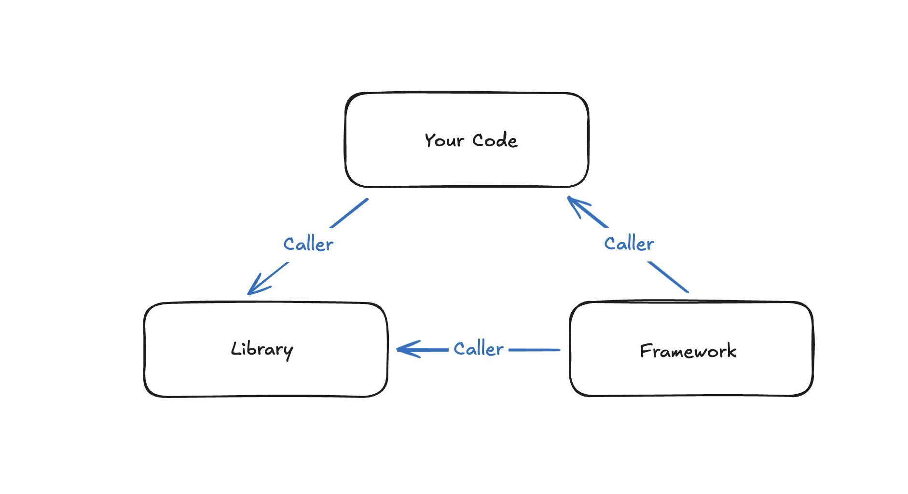

# Day 1

비어있는 폴더를 멍하니 바라보며 하나씩 생각을 정리해봅니다.

결과적으로 React랑 비슷한걸 만들게 되더라도 가급적 React라는 것을 머리에서 지워봅시다. 오직 UI를 만들 수 있는 그 무언가를 만든다는 것만 생각하고 하나씩 의사결정을 해보는겁니다.

### [1] Framework vs Library (feat. IoC)

"프레임워크를 만들어야할까요, 라이브러리를 만들어야할까요"

곰곰히 고민해보았는데 프레임워크는 뭔가 거창합니다. 하물며 [React](https://react.dev/)는 스스로 공식 문서를 통해 프레임워크가 아닌 라이브러리라고 표현합니다. 그래서 정확한 정의를 한 번 찾아보고 왔습니다.

StackOverflow를 찾다보니 무려 17년 전에 동일한 [질문](https://stackoverflow.com/questions/148747/what-is-the-difference-between-a-framework-and-a-library)을 남긴 사람이 있습니다.

그리고 624개(작성 시점 기준)의 upvote를 받은 답변이 있습니다.

```
A library performs specific, well-defined operations.

A framework is a skeleton where the application defines the "meat" of the operation by filling out the skeleton. The skeleton still has code to link up the parts but the most important work is done by the application.

Examples of libraries: Network protocols, compression, image manipulation, string utilities, regular expression evaluation, math. Operations are self-contained.

Examples of frameworks: Web application system, Plug-in manager, GUI system. The framework defines the concept but the application defines the fundamental functionality that end-users care about.
```

한글로 해석해보면 다음과 같습니다.

"라이브러리는 **특정 작업들을 수행**하는 도구이고 그 자체로 완결성을 가집니다. 필요할 때 사용자가 **호출**해서 사용합니다"

"프레임워크는 **어플리케이션의 뼈대 역할**을 합니다. 사용자는 이 뼈대 안을 채워넣어 실제 기능을 수행합니다"

**누가 누구를 호출하는지** 를 생각해보면 간단합니다. 라이브러리는 작성자가 라이브러리 코드를 호출하는 반면, 프레임워크는 프레임워크가 작성자의 코드를 호출하는 구조입니다. 이 케이스를 소프트웨어 설계 관점에서 표현하면 **IoC(Inversion of Control)** 이라고 합니다.



여기까지의 내용을 정리해보면, 아직은 규칙을 설계하고 그 규칙에 어플리케이션을 채워넣기에는 무리입니다.
우선은 "라이브러리"를 만든다는 접근이 맞아보입니다.

### [2] 라이브러리를 왜 만들까요

저는 React 생태계에서 주로 개발을 해왔지만, Vue, Angular, Svelte, Solid, Qwik 과 같은 다른 세상이 있다는 것은 알고 있습니다. 그럼에도 우선은 뭐가 어떻고, 뭐는 어떻고 이런 생각을 조금 지워보고 우선 라이브러리를 만드는 것에 집중해볼게요.

결국 웹은 문서(document)입니다. JS로 기능을 넣고 동적으로 무엇을 하는 것은 어플리케이션(application)이 되면서 중요시되기 시작한 것입니다. 이 과정에서 몇 가지 문제가 드러나기 시작했습니다.

먼저 DOM은 조작하기가 번거롭습니다.  
DOM API가 너무 장황하기도 하거니와, 조작 -> 이벤트 -> 조작 -> 이벤트 처럼 계속 상태나 데이터와 DOM을 동기화시켜주어야 합니다.

다음으로 UI가 복잡할수록 구조 파악이 어렵습니다.  
document의 길이가 엄청나게 길어지고, UI/로직/상태 등의 관심사가 한데 뒤섞이기도 합니다.

마지막으로 결국 같은 패턴이 너무 많아집니다.  
이벤트 달고 DOM 업데이트하고 상태 저장하고 반영하는 패턴이 수두룩합니다.

"라이브러리"는 이런 문제를 해결하기 위해 존재하는겁니다.

### [3] 무엇을 해결해야할까요

#### 상태(state)와 UI(view)를 연결

> `UI = f(state)`.

UI는 State의 표현입니다.  
상태(state)의 형태를 정의하고, 상태는 UI를 만들 뿐입니다.

#### DOM 조작을 간편하게

> 라이브러리는 편해야합니다. DOM 조작을 추상화해주어야 합니다.

개발자는 "무엇"을 만들지 고민하고, 라이브러리는 "어떻게" 만들지를 책임집니다.

#### 지속 가능한 구조로

> 가급적이면 좋은 코드를 작성할 수 있어야 개발자가 지속적으로 유지할 수 있는 구조가 됩니다.

자연스럽게 관심사를 분리할 수 있게 해서 안정적인 구조로 작성할 수 있어야 합니다.

위 3개의 아이디어를 라이브러리의 철학(philosophy)으로 정해보도록 하겠습니다.  
구체적이지 않고 단순하지만 나름 단단한 것 같습니다. 대단히 특별할 것도 없는, 프론트엔드 개발자라면 다들 쉽게 고개를 끄덕일 수 있을 내용이지 않을까요.

### [4] UI를 그려봅시다

UI는 결국 어떤 시점의 데이터를 화면에 투영한 결과라고 생각합니다.  
이 생각을 하나의 식(式)으로 표현해보면 다음과 같습니다.

`UI = f(state)`

여기서 `state`는 어플리케이션이 가지고 있는 실질적인 데이터입니다.  
하지만 UI를 그리기 위해서는 DOM으로 그릴 수 있는, **렌더링 가능한 형태로 구조화된 데이터**가 필요합니다.  
이 글에서는 구조화된 UI의 표현을 `Render Schema(약칭 Schema)`라고 부르겠습니다.

- state: 애플리케이션의 실제 데이터
- render schema: state를 기반으로 만들어진 “UI를 그릴 수 있는 묘사 데이터”
- UI: schema를 DOM으로 변환한 실제 화면

즉 흐름을 정리하면 다음과 같습니다.

```
state -> render schema -> UI
```

저는 고수를 안좋아하는데요, 예를 들어 아래처럼 간단한 UI가 있다고 해봅시다.

```html
<h1>저는 고수가 싫어요</h1>
```

이 HTML 구조를 프로그래밍적으로 표현한 schema는 다음처럼 만들 수 있습니다.

```js
const schema = {
  type: "h1",
  content: "저는 고수가 싫어요",
};
```

아직 props도 없고, children도 없고, nested 구조도 고려하지 않았습니다.  
하지만 일단 “태그(type)”와 “내용(content)”만으로 충분히 하나의 UI를 표현할 수 있으니 여기서 출발합니다.

이제는 schema를 실제 DOM Element로 만들어주는 렌더러(renderer)를 만들어야겠죠.

딱 "한 개의 태그와 한 개의 텍스트"만을 처리(변환)하는 렌더러 함수를 상상해봅시다.
(아직은 typescript도 사치입니다)

```js
// packages/core/src/index.js

function render(schema, container) {
  const el = document.createElement(schema.type);
  const text = document.createTextNode(schema.content);
  el.appendChild(text);

  container.appendChild(el);
}
```

매우 단순하지만 1) schema 객체를 받아서, 2) DOM Element를 만들고, 3) 지정한 컨테이너에 붙이는 기능을 수행합니다.

그리고 이 렌더링 함수는 다음과 같이 사용합니다.

```js
// playground/src/main.js

import { render } from "@cilantro/core";

const schema = {
  type: "h1",
  content: "저는 고수가 싫어요",
};

const container = document.getElementById("app");
render(schema, container);
```

```html
<!-- playground/index.html -->

<html>
  ...
  <body>
    <div id="app"></div>
    <script type="module" src="/src/main.js"></script>
  </body>
</html>
```

그러면 우리가 기대한 UI가 나오게됩니다.


<p style="text-align: center; color:#aaaaaa;">실행 결과</p>

- UI는 state의 결과다
- schema은 DOM을 그리기 위한 중간 표현이다
- render는 schema를 실제 UI로 바꿔주는 함수다

이 세 가지가 명확해지면 앞으로 attributes, children, nested 구조, 이벤트, 업데이트 등 더 복잡한 기능을 자연스럽게 확장할 수 있습니다.

오늘 작성한 내용의 전체 코드는 아래에서 보실 수 있습니다.

> Day1: https://github.com/jaehuiui/hate-cilantro/tree/day-1
