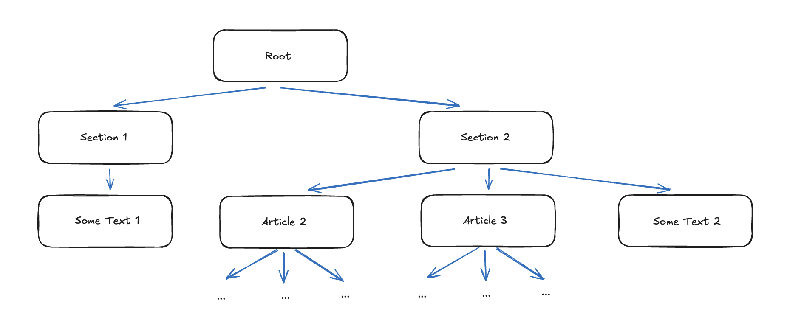
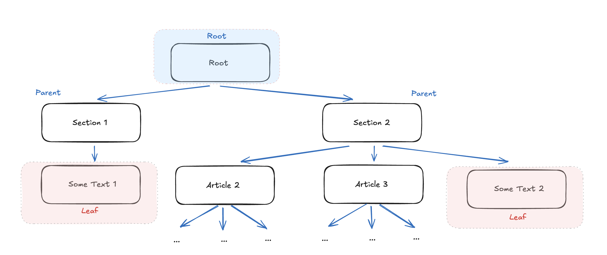
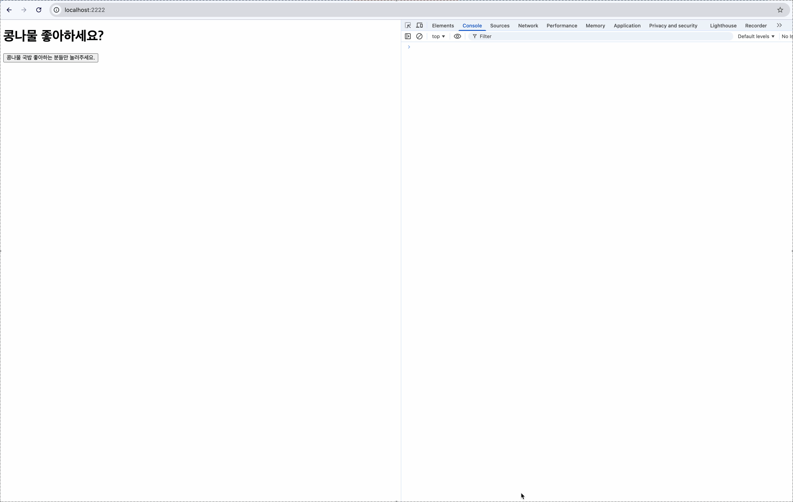

# Day 2: JS로 UI를 그려봅시다


오늘은 JS로 DOM을 표현하는 콩나물만의 규칙이자 인터페이스를 정의해보려 합니다.

지난 글에서 강조했던 것처럼 인터페이스를 정의하는데 기본이 될 요소들은 다음과 같습니다.

1. HTML 요소(Tag)
2. HTML 속성(Attribute / Properties)
3. 트리 구조

DOM 메소드를 사용해서 위 3개의 정보가 담긴 데이터를 화면에 렌더링하는 것에 우선 집중해보겠습니다.  
동작이나 스타일이나 리렌더링과 같은 상세 명세는 그 다음 스텝입니다.

### [1] 인터페이스 이름은 schema가 좋겠습니다

```html
<div id="container">
  <h1 id="title">콩나물 좋아하세요?</h1>
  <p id="description">콩나물 국밥은 참 맛있습니다.</p>
</div>
```

간단한 콩나물 국밥 광고처럼 보이지만 3개의 요소들을 모두 만족하는 문서라고 할 수 있습니다.  
**`tag` 정보도, `id`라는 속성 정보도, container -> title / description 으로 이어지는 부모-자식 트리 구조도 포함**하고 있습니다.

이를 객체로 작성해보면 다음과 같은 형태일 것입니다.

```js
// playground/src/main.js

const schema = {
  type: "div",
  props: {
    id: "container",
  },
  children: [
    {
      type: "h1",
      props: {
        id: "title",
      },
      children: ["콩나물 좋아하세요?"],
    },
    {
      type: "p",
      props: {
        id: "description",
      },
      children: ["콩나물 국밥은 참 맛있습니다."],
    },
  ],
};
```

이 인터페이스는 앞으로 **schema**라는 이름으로 부르도록 하겠습니다.  
schema라는 표현은 생각보다 범용적인 표현입니다.  
데이터베이스에서는 저장되는 데이터에 대한 설계도의 의미로, 인지과학이나 언어학에서는 지식을 표상하는 구조라는 의미로 사용되곤 합니다.

schema에서 `children` 필드를 살펴보면 1차원 배열(1-dimension array)입니다.  
트리 구조에서 자식 노드들 간에는 위계가 없고, 자식 노드는 복수 개일 수 있기 때문입니다.

아무튼 전체적인 구조와 그럴듯한 명칭을 정했으니 이제 다음 단계로 넘어가보겠습니다.

### [2] schema를 UI로 그려봅니다

이번에는 반대로 schema를 UI로 다시 그려볼 차례입니다.



schema를 주입받아서 UI로 변환해주는 함수는 익숙한 `render` 함수라고 표현해보겠습니다.  
renderer를 만들 때 신경써야할 내용 역시 schema의 기본이 되는 3개의 내용과 동일합니다.

- `type`에 해당하는 **HTML 태그를 생성**할 수 있어야 합니다.
- `props`에 해당하는 **속성 정보를 요소에 매핑**할 수 있어야 합니다.
- `children`도 하나의 schema이자 서브 트리이기 때문에 **재귀(recursive) 구조**로 동작해야합니다.

아직은 요구조건이 그다지 복잡하지는 않은 것 같습니다.  
아마 이렇게 render 함수를 작성하면 되지 않을까요.

```js
// packages/core/src/index.js

export function render(schema, container) {
  // Leaf Node: 문자열이면 텍스트 노드 생성
  if (typeof schema === "string") {
    const textNode = document.createTextNode(schema);
    container.appendChild(textNode);
    return;
  }

  // Parent Node: Element 생성
  const el = document.createElement(schema.type);

  // Element: 속성 매핑
  if (schema.props) {
    Object.entries(schema.props).forEach(([key, value]) => {
      el.setAttribute(key, value);
    });
  }

  // Element: 재귀적으로 children 렌더링
  if (schema.children) {
    schema.children.forEach((child) => {
      render(child, el);
    });
  }

  // Element: 동적으로 DOM에 연결
  container.appendChild(el);
}
```

실제로 사용하는 곳에서는 아래처럼 단순히 render 함수에 schema와 컨테이너를 연결하면 됩니다.

```js
// playground/src/main.js
import { render } from "@kongnamul/core";

// schema 중략

const container = document.getElementById("app");
render(schema, container);
```

아래 이미지처럼 UI가 잘 그려지는 것을 볼 수 있습니다.



지금 renderer는 매우 단순하고 정직하고 '순수'합니다.
schema라는 설계도를 읽고 구조 그대로 DOM을 output으로 생성할 뿐입니다.

- 이전 UI를 기억하지 않고
- 변화가 있었는지도 모르며
- 언제 다시 호출되는지도 알지 못합니다.

### [3] Schema는 얼마나 똑똑해야 하나요

schema와 짝을 이루는 renderer를 만들어 화면에 그리는 것은 성공을 했습니다.

그럼에도 schema를 UI를 그리기 위한 일종의 **설계도이거나 설명서**로 본다면,  
왠지 아직은 schema가 조금 부족해보입니다.

아예 파격적으로 schema 하나로 UI의 모든 것을 설명해보는 것은 어떨까요?

- 클릭 시 어떤 함수가 실행되는지
- 화면 크기에 따라 어떻게 변하는지
- 언제 생성되고 언제 파괴되는지
- 상태가 바뀌면 무엇을 다시 그릴지

실제로 이와 유사한 접근을 택한 UI 프레임워크도 존재하는 것으로 알고 있습니다.

하지만 이 선택을 내린다면 render schema는 UI의 묘사(description)를 넘어, UI의 실행 계획(plan)까지 포함하게 됩니다.  
당연히 아래와 같은 Trade-off가 발생합니다,

1. 렌더 함수나 스키마의 구조가 너무 복잡해지고 **렌더러와 강하게 결합**됩니다. 단순히 무엇을 그린다를 넘어 그리는 조건까지 알고 있기 때문입니다.
2. 데이터라기보단 실행 규칙을 담은 '**코드**'에 가까워집니다.
3. 가장 중요한 점은 실행 계획에 해당하는 이전 상태와 변경 여부가 포함되면 더 이상 '**언제든 다시 만들 수 있는 데이터**'가 아니게 됩니다.

즉, schema는 단순한 데이터를 넘어 **규칙과 의미(semantics)를 포함한 'DSL(Domain Specific Language)'의 개념**으로 확장됩니다.

고로 현재로선 schema는 '무엇을 그릴지'만 알고 '어떻게 동작할지'는 모르는 것으로 그 역할을 한정해보겠습니다.  
실행의 **책임**은 renderer와 외부에 맡기고 **언제든 다시 만들 수 있는 순수한 UI description 데이터**로 정의하는 것입니다.

### [3-1] DSL은 무엇일까요?

바로 앞선 챕터에서 'DSL' 이라는 표현을 사용했습니다.  
라이브러리라는 작고 작은 하나의 도메인을 **설계, 디자인**하는 입장에서 어떤 의미인지는 **아주 얕고 가볍게**만 짚고 넘어가면 좋을 것 같습니다.

C, Java, Python, XML과 같이 범용적으로 사용되는 GPL(General Purpose Language)와 대조되는 개념으로,  
특정 영역에 한정되어 사용되는 컴퓨터 언어라고 합니다.  
물론 그 경계가 항상 명확하지는 않은 스펙트럼과 같은 개념일 것입니다.

DSL에는 SQL, CSS, HTML, MATLAB과 같이 말 그대로 특정 도메인에서만 사용되는 특정 도메인의 문제를 표현하기 위한 언어입니다.

여러 자료들을 읽고 고민해본 결과,
제가 이 글에서 DSL의 경계를 나누는 기준은 다음으로 정리해보겠습니다.

> DSL은 단순히 데이터(data)를 넘어 의미(semantics)를 가진 언어이고, 의미를 해석하기 위한 규칙과 제약이 수반됩니다.

그러면 JSX라는 조금 더 구체적인 예시를 들어보겠습니다.

'JSX도 UI를 설명하는 도메인 특화 언어가 아닐까요, JSX도 DSL이지 않나요?'

```jsx
// jsx
<h1>안녕하세요</h1>

// 컴파일 이후
React.createElement("h1", null, "안녕하세요")

// 런타임
{
  type: "h1",
  props: {},
  children: ["안녕하세요"]
}
```

제 관점에는 JSX는 자체는 어떠한 의미(semantics)를 정의하지는 않습니다.  
Preact, Solid와 같은 다른 런타임 환경에서도 재정의될 수 있기 때문입니다.

Babel이라는 transpiler가 단순히 구문 변환(syntactic desugaring)을 하는 것뿐입니다.  
어떠한 의미 판단이 들어가지도, 렌더링 제어도, 업데이트 전략도 포함하지 않습니다.  
컴파일러 레벨에서는 semantic phase가 없는 단순 macro expansion 입니다.

물론 그럼에도 JSX는 eDSL(embedded DSL)나 내부 DSL(internal DSL)로 분류된다고 하기도 합니다.

반대로 이런 예시가 schema가 DSL이 되는 케이스일겁니다,

```js
{
  type: "h1",
  children: ["안녕하세요"],
  when: "mounted",
  rerenderOn: ["user"],
  visibleIf: "windowOnRefetch"
}
```

이야기가 다소 길어지고 복잡해졌지만 한 번쯤 생각해봄직한 내용이었길 바랍니다.

[참고 자료]

- Martin Fowler의 DSL: https://www.martinfowler.com/dsl.html / https://www.martinfowler.com/articles/languageWorkbench.html#ExternalDsl
- DSL Wikipedia: https://en.wikipedia.org/wiki/Domain-specific_language
- Compiler design: https://www.geeksforgeeks.org/compiler-design/introduction-of-compiler-design/

### [4] 동작을 담아봅시다

지금까지 구현된 내용을 보면 문서가 몹시도 정적입니다.  
render 함수도 단순히 serialize 해주는 것밖에 하지 않구요.

DSL이 되지 않는다는 관점을 고수하면서 schema의 `props`를 확장해봅니다.  
이벤트가 추가되어야 합니다. 이벤트는 부가적인 실행 계획 레벨이 아닌 UI의 속성이자 표현입니다.

- 문자열 props: `id`, `class`, `props`
- primitive props: boolean 필드 등
- 함수형 props: `click handler`, `input handler`

주의할 점은 함수형 props에 DSL의 경계선을 넘지 않도록 렌더링 전략이나 상태 의존성을 포함해서는 안됩니다.  
오직 DOM API에 직접적으로 매핑 가능한 정보만 포함합니다.

익숙한 패턴을 차용해서 `onClick`과 같이 이벤트 핸들러 props의 이름 규칙을 정해보겠습니다.

> prefix + event name(Pascal Case) -> `on` + `Click`

schema 코드는 이렇게 수정해보았습니다.

```js
// playground/src/main.js

const schema = {
  type: "div",
  props: {
    id: "container",
  },
  children: [
    {
      type: "h1",
      props: {
        id: "title",
      },
      children: ["콩나물 좋아하세요?"],
    },
    {
      type: "button",
      props: {
        onClick: () => {
          console.log("클릭 이벤트입니다.");
        },
      },
      children: ["콩나물 국밥 좋아하는 분들만 눌러주세요."],
    },
  ],
};
```

render 함수에도 이벤트 핸들러를 파싱해줄 수 있도록 확장해보면,

```js
// packages/core/src/index.js

export function render(schema, container) {
  // Leaf Node: 문자열이면 텍스트 노드 생성
  if (typeof schema === "string") {
    const textNode = document.createTextNode(schema);
    container.appendChild(textNode);
    return;
  }

  // Parent Node: Element 생성
  const el = document.createElement(schema.type);

  // Element: 속성 매핑
  if (schema.props) {
    Object.entries(schema.props).forEach(([key, value]) => {
      // Props: Event Handler 등록
      if (key.startsWith("on") && typeof value === "function") {
        const eventName = key.slice(2).toLowerCase();
        // TODO: Event Validation 추가
        el.addEventListener(eventName, value);
      }
      // Props: 나머지 Props 등록
      else {
        el.setAttribute(key, value);
      }
    });
  }

  // Element: 재귀적으로 children 렌더링
  if (schema.children) {
    schema.children.forEach((child) => {
      render(child, el);
    });
  }

  // Element: 동적으로 DOM에 연결
  container.appendChild(el);
}
```



로그가 아주 잘 찍힙니다.

이제야 비로소 라이브러리의 가치가 한방울 담긴 느낌입니다.  
단순히 JS로 DOM을 만든다는 것을 넘어서 DOM API로 해석하는 역할도 수행합니다.

이렇게 끝나면 좋겠지만,  
뭔가 중요한 점을 놓치고 은근슬쩍 지나간 것만 같은 기분이 듭니다.

```js
if (key.startsWith("on") && typeof value === "function") {
  const eventName = key.slice(2).toLowerCase();
  el.addEventListener(eventName, value);
}
```

여기에도 고민해볼만한 디테일이 있습니다.

- 이벤트 캡처링(capturing)이 아닌 버블링(bubbling)만을 기준으로 했고,
- `capture`, `passive` 와 같은 옵션도 없고,
- React에서 볼 수 있는 위임(delegation) 패턴도 없습니다.

schema에서 어떤 노드가 클릭 이벤트를 가지고 있다라는 정보만 담고,  
renderer는 연결(binding)하는 역할을 수행합니다.

schema에 위 정보들을 담아버리면 순수한 UI description을 넘어 DSL이 되기 때문입니다.

### [5] 마치며

오늘은 결정하고 구현한 내용들은,

- schema가 UI description에 불과하고 DSL이 되지 않는 것
- renderer는 DOM Binding을 담당하는 순수한 함수
- DSL / GPL의 기준을 정의합니다

내일은 schema를 언제, 왜, 어떻게 다시 만들어질 수 있을지 이야기해보겠습니다.

오늘의 이야기 역시 자그마한 고민거리가 되었으면 좋겠습니다.

Day2의 전체 코드는 아래 링크에서 보실 수 있습니다.

> Day2: https://github.com/jaehuiui/kongnamul/tree/day-2
