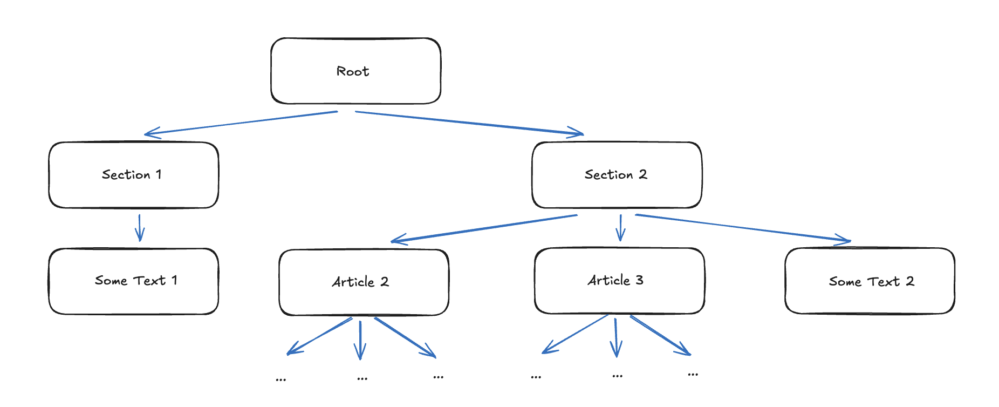
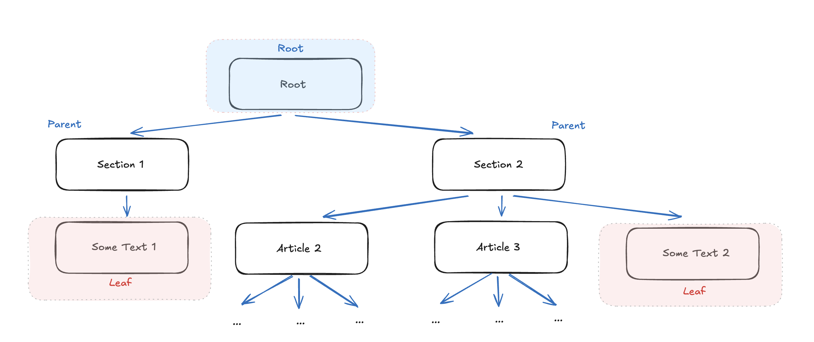
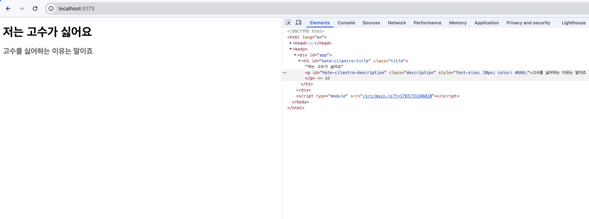

# Day 2

첫째 날에는 태그 하나와 텍스트 하나를 가진 간단한 UI 하나를 그리는데 성공했습니다.

"UI는 결국 데이터(State)의 결과물이다."

UI를 그릴 수 있는 구조화된 데이터를 `Render Schema`라 정의했고,  
그 schema를 DOM Element로 변환할 수 있는 render 함수를 만들었습니다.

오늘은 첫째 날에 이어서 이 schema에 조금 더 집중해볼 생각입니다.

### [1] Schema는 얼마나 똑똑해야하나요

schema는 렌더러가 UI를 그리기 위한 일종의 설계도이니, UI를 조금 더 디테일하게 표현하기 위한 속성(attribute)나 계층과 같은 정보가 있어야할 것만 같습니다.

그렇다면 더욱 파격적으로 schema 하나로 UI의 모든 것을 설명해보는 것은 어떨까요?

- 클릭 시 어떤 함수가 실행되는지
- 화면 크기에 따라 어떻게 변하는지
- 언제 생성되고 언제 파괴되는지
- 상태가 바뀌면 무엇을 다시 그릴지

물론 만들려고 하면 만들 수는 있습니다. 
하지만 render schema는 UI의 묘사(description)만 알면 되지, UI의 실행 계획(plan)까지 가지는 순간 중요한 문제가 생깁니다. 

1. 렌더 함수나 스키마의 구조가 너무 복잡해지고, 렌더러와 강하게 결합됩니다.
2. 데이터라기보단 "코드"에 가까워집니다.

즉, 이러한 schema는 더 이상 데이터가 아니라 "DSL(Domain Specific Language)"이 되어버린다는 점입니다.

고로 schema는 "무엇을 그릴지"만 알고, "어떻게 동작할지"는 모르는 것으로 그 역할을 정리해보겠습니다.

### [2] Schema를 트리구조로

나름대로 schema의 역할에 대한 기준은 세웠으니, 한 걸음씩 발전시켜 보겠습니다.

schema의 전체적인 형태는 어떻게 생겨야할까요?

조금은 작위적일 수 있지만 가장 먼저 트리(Tree)구조가 떠오릅니다.    
HTML 문서도, DOM도, 사람이 시각적으로 인식하는 UI도 전부 트리구조이기 때문이지 않을까요.

하지만 저는 리스트(List), 플랫한 배열(1-dimension Array), 심지어 그래프 구조(Graph)와 같은 대부분의 자료구조로 전부 표현할 수 있다고 생각합니다.

그럼에도 이미 트리구조가 많이 사용되는 이유는 트리구조가 가진 특성 때문일겁니다.  

> A tree data structure is a hierarchical structure that is used to represent and organize data in a way that is easy to navigate and search. It is a collection of nodes that are connected by edges and has a hierarchical relationship between the nodes.

- 부분(Subtree)을 독립적인 의미 단위로 다룰 수 있고,
- 부모가 바뀌면 자식의 맥락도 함께 재해석되며,
- UI를 루트에서 리프까지, 위에서 아래로 해석할 수 있습니다.




고로 Render Schema 역시 **트리구조로 표현할 수 있도록 합시다.**  
하지만 첫째 날 작성한 schema를 다시 살펴보면 content 필드는 너무 제한적입니다. 


```js
{
  type: "h1",
  content: "..."
}
```

이 구조로는 “하나의 텍스트만 가진 노드” 밖에 표현할 수 없습니다. 그래서 schema를 트리로 확장합니다. UI 트리를 표현하는 가장 단순한 방법은 자식 노드를 배열로 가지는 것입니다.

```js
{
  type: "h1",
  children: ["저는 고수가 싫어요"]
}
```

자연스럽게 children 배열에는 노드(새로운 하나의 schema)가 담길 수 있고, 이를 **재귀(recursive) 구조**라 표현합니다.  

### [3] UI의 속성을 표현해봅시다

다음은 schema에 존재하는 UI 하나 하나를 조금 더 디테일하게 표현할 수 있는 description에 해당하는 정보가 필요합니다. 흔히 attributes, 혹은 props라고 부르는 "속성"을 추가할 차례입니다.

(뜬금없지만 네이밍 자체의 수려함은 중요하지 않다고 생각합니다. 그럼에도 대중적으로 사용하는 것, 다른 동료 혹은 누군가가 읽고 이해가 되는 직관적인 표현으로 작성하려고 노력하고 있습니다.)

```js
{
  type: "h1",
  props: {
    id: "hate-cilantro-title"
    class: "title"
  },
  children: ["저는 고수가 싫어요"]
}
```

이제는 `id`나 `class` 같은 표현을 위한 "속성" 정보도 schema에 추가되었습니다.

이것으로 schema는 1) 트리 구조를 그릴 수 있도록 재귀적인 구조로 진화했고, 2) UI를 구체적으로 표현할 수 있는 속성 필드가 추가되었습니다.

지금까지 schema를 확장하는데 공을 쏟았지만, 마지막으로 중요한 점을 짚고 넘어가려고 합니다.  

**"schema는 사용자가 직접 조작하는 대상이 아닙니다."** 

단순히 데이터(상태)로부터 만들어지며, 언제든 버려질 수 있는 중간 결과물에 불과합니다.

Render Schema는 캐시(cache)되지 않아도 되고, 비교(diff)되지 않아도 되고, 언제든 폐기되어도 괜찮은 존재입니다.

### [4] 렌더 함수를 고쳐봅시다. 순수하게요

지금까지 schema를 확장하는데 공을 쏟았습니다.  
허나 schema는 의미만 담는 설계도에 불과하고, 그 의미를 실제 DOM으로 옮기는 책임은 renderer가 가집니다.

이렇게 중요한 "책임"을 가진 렌더 함수를 만들어볼 차례입니다.

```js
// (day1) packages/core/src/index.js 

function render(schema, container) {
  const el = document.createElement(schema.type);
  const text = document.createTextNode(schema.content);
  el.appendChild(text);

  container.appendChild(el);
}
```

첫째 날의 함수는 재귀 구조와 속성을 처리해줄 수 없으니, 변환하는 로직을 조금 더 보완해줄 차례입니다.




본 글에서 트리구조라는 자료 구조를 깊이 있게 설명하지는 않겠지만, 용어 몇 개는 정리해서 적어둡니다.

- Node: 각각의 네모를 지칭합니다.
- Root / Parent / Child Node: 각각 최상단, 자식이 있는 노드, 부모를 가지고 있는 노드
- Leaf Node: 자식 노드가 없는 노드 (=External Node)


```js
// packages/core/src/index.js

function render(schema, container) {
  // 문자열이면 텍스트 노드 생성(schema가 leaf node인 경우)
  if (typeof schema === "string") {
    const textNode = document.createTextNode(schema);
    container.appendChild(textNode);
    return;
  }

  // UI를 생성
  const el = document.createElement(schema.type);

  // UI에 props 할당
  if (schema.props) {
    Object.entries(schema.props).forEach(([key, value]) => {
      el.setAttribute(key, value);
    });
  }

  // UI의 children 렌더링
  if (schema.children) {
    schema.children.forEach((child) => {
      render(child, el);
    });
  }

  container.appendChild(el);
}
```

다음과 같이 작성하면 재귀적으로 실행되며 각 UI에 속성을 할당해줄 수 있을겁니다.  

이렇게 구현한 렌더함수를 실제로 playground에서 실행을 해보면,

```js
// playground/src/main.js

import { render } from '@cilantro/core'

const schema = {
  type: 'h1',
  props: {
    id: 'hate-cilantro-title',
    class: 'title',
  },
  children: [
    '저는 고수가 싫어요',
    {
      type: 'p',
      props: {
        id: 'hate-cilantro-description',
        class: 'description',
        style: 'font-size: 20px; color: #666;',
      },
      children: ['고수를 싫어하는 이유는 말이죠'],
    },
  ],
}

const container = document.getElementById('app')
render(schema, container)
```



우리의 의도대로 자식 구조를 그리는데 성공했고, 속성 정보도 잘 들어가는 것을 볼 수 있습니다. 

렌더 함수에 대한 이야기를 마지막으로 둘째 날의 이야기를 마무리해보려고 합니다.

지금 renderer는 매우 단순하고 정직하고 또 "순수"합니다.
schema라는 설계도를 읽고, 그 구조 그대로 DOM을 생성할 뿐입니다.

- 이전 UI를 기억하지 않고
- 변화가 있었는지도 모르며
- 언제 다시 호출되는지도 알지 못합니다.

내일부터는 본격적으로 UI의 "업데이트"에 대해 말해보려고 합니다.

오늘의 이야기도 자그마한 고민거리가 되었으면 좋겠습니다.

Day2의 전체 코드는 아래 링크에서 보실 수 있습니다.

> Day2: https://github.com/jaehuiui/hate-cilantro/tree/day-2
